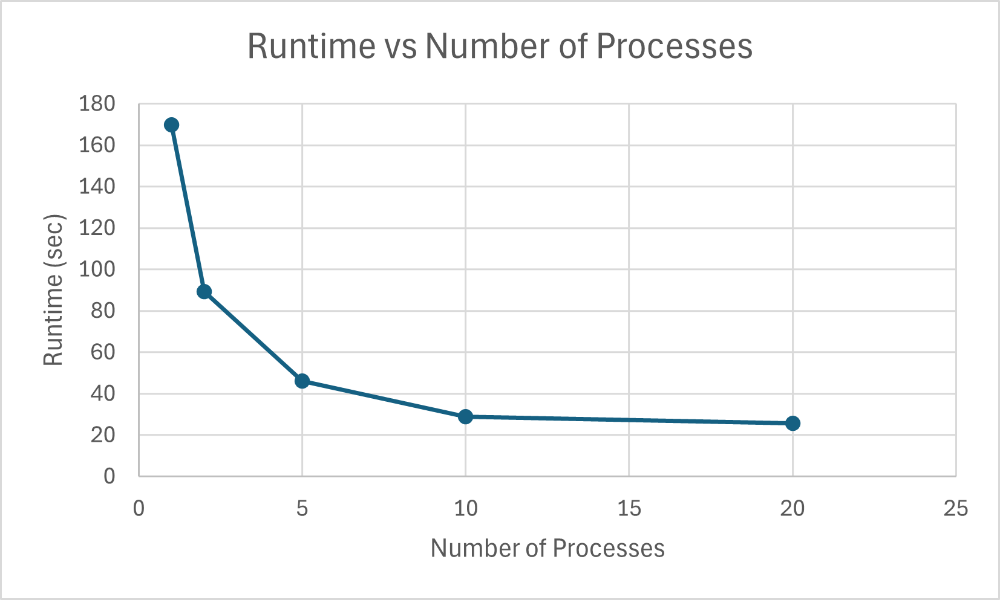
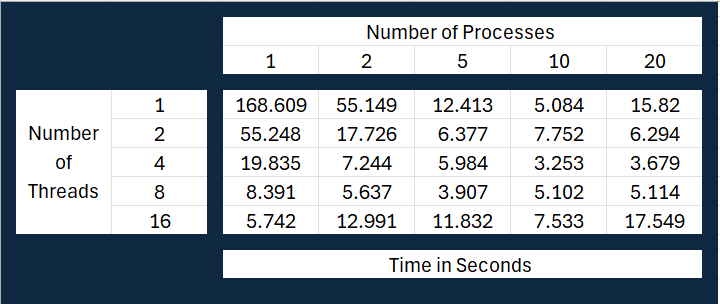

# System Programming Lab 11 Multiprocessing

## Overview of Implementation

This project implements a program called `mandelmovie` that generates a series of Mandelbrot set images and combines them into a video. The program uses multiprocessing to speed up the generation of these images by allowing multiple child processes to run concurrently. The number of child processes is configurable via a command-line argument.

The key components of the implementation include:
- Using the `fork()` system call to create child processes.
- The `exec()` family of functions to invoke the existing `mandel` program for each image.
- Synchronizing processes using `wait()` to ensure all children complete before exiting.
- Creating a movie from the generated images using `ffmpeg`.

## Runtime Results

The graph below illustrates the runtime of the program with varying numbers of child processes. The data shows how runtime decreases as the number of processes increases, up to a point where additional processes provide diminishing returns due to system overhead.

## Discussion of Results

From the runtime analysis:
- **1 Process**: The program runs serially, and the runtime is the longest since only one image is generated at a time.
- **2 Processes**: A significant reduction in runtime occurs, as two images are generated concurrently.
- **5 Processes**: The runtime continues to decrease, showing the advantage of parallel processing.
- **10 Processes**: The runtime reduction slows as system resources become more constrained.
- **20 Processes**: Diminishing returns are evident due to the overhead of managing a large number of child processes and potential system limitations (e.g., CPU and I/O bottlenecks).

This analysis demonstrates the trade-off between parallelism and system resource management, highlighting the importance of balancing the number of processes for optimal performance.

# System Programming Lab 12 Multithreading

## Overview of Implementation

This project extends the `mandelmovie` program by incorporating multithreading in addition to multiprocessing. The number of threads used per process is configurable via a command-line argument. Multithreading further optimizes the runtime by dividing the workload of each process among multiple threads.

The key components of the implementation include:
- Using the `fork()` system call to create child processes.
- Dividing the frames assigned to each process among multiple threads.
- Using `pthread` for thread creation and synchronization within each process.
- Combining the benefits of multiprocessing and multithreading to minimize runtime.

## Runtime Results

The graph below illustrates the runtime of the program with varying numbers of processes and threads. The data shows how runtime decreases as the number of threads and processes increases, up to a point where additional threads or processes provide diminishing returns due to system overhead.

## Discussion of Results

From the runtime analysis:
- **Sweet Spot**: The optimal runtime was achieved with 10 processes and 4 threads per process. This configuration balanced the workload effectively across system resources.
- **Impact of Multithreading vs Multiprocessing**: Both techniques significantly reduced runtime. However, multiprocessing had a more noticeable impact initially, as it allowed independent execution of processes. Multithreading further optimized runtime within each process by leveraging multiple CPU cores more effectively.
- **Diminishing Returns**: Beyond 10 processes and 4 threads, the runtime improvements slowed due to increased overhead from managing a large number of processes and threads.

### Questions

i. **Which technique seemed to impact runtime more – multithreading or multiprocessing? Why do you think that is?**
   - Multiprocessing had a greater initial impact on runtime since it allowed independent execution of processes on separate cores. Multithreading complemented this by optimizing resource utilization within each process.

ii. **Was there a “sweet spot” where optimal (minimal) runtime was achieved?**
   - Yes, the sweet spot was at 10 processes and 4 threads per process, where the runtime was minimal, balancing system resources effectively.
